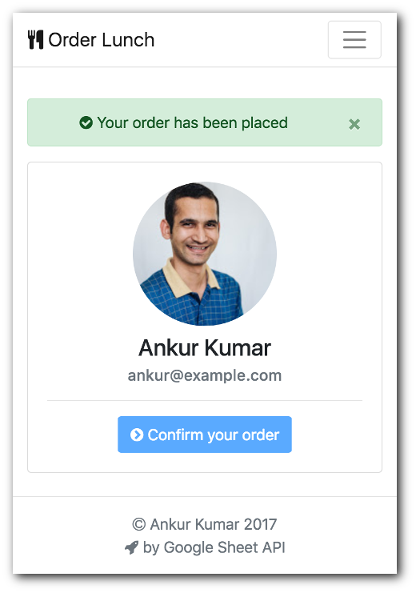

# Lunch Order Vue.js App

> This is a Single Page Application, powered by Vue.js and Google Spreadsheet.

> This app allows users to record their lunch orders in a Google Spreadsheet.



## Prerequisites
* node js >=8.9.0
* npm >=5.7.1 || yarn 1.5.1+
* Google API Web Client ID, [create here](https://console.developers.google.com/)
    * Enable Google Sheets API
    * Enable Google+ API
    * Whitelist ```http://localhost:9000```
* A Google Spreadsheet to use as database (see `config.example.js`)
* End-users should have write permission on this spreadsheet

### Run on localhost
* Create a new [Google Spreadsheet](https://sheets.google.com)
* Create a empty sheet within this spreadsheet, name it ```Template```, see template format below
* Clone this repo
* Create ```config.js``` file on project root, copy from ```config.example.js```
* Fill valid details in config.js file
```
# Install dependencies
yarn install

# Run local server at localhost:9000
yarn run dev
```
* Generate dist (production ready) folder
```
yarn run prod
```

### Google SpreadSheet template format

| **ForDate**   | **ForEmail**      | **OrderedAt**       |
| ------------- |:-------------:    | ------------------: |
| 28/1/2018    | test.user@example.com  | 28/1/2018, 9:51:47 AM |
| 29/1/2018    | user.name@example.com  | 29/1/2018, 10:51:47 AM |


### Resources
* [Google Sheet JS API](https://developers.google.com/sheets/quickstart/js)
* [Vue.js](https://vuejs.org/) v2.x
* [Webpack](https://github.com/webpack/webpack)

### TODOs
* Implement policies and restrictions
* Allow cancel today order
* Show today records in table

### License
MIT License
